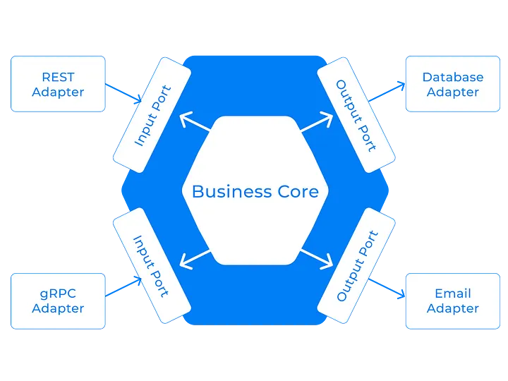

### Customer API

* API developed with Java 17 and Spring Boot 3

---

### ⚡ Technologies
These are some of the technologies and tools that I work with:


[](https://spring.io/projects/spring-boot)
[](https://opentelemetry.io/)
[](https://www.jaegertracing.io/)
[](https://spring.io/projects/spring-cloud)

---

## Hexagonal Architecture


### 🚀 Overview
The Customer API is built using the hexagonal architecture and provides a RESTful interface for managing customer data. The API is equipped to capture traces using OpenTelemetry and Jaeger and integrates with an external address API via Spring Feign Client to fetch customer addresses. It supports the following operations:
- **POST /api/v1/customers**: Create a new customer
- **GET /api/v1/customers/document**: Retrieve a customer by CPF (query parameter)

### 🌐 API Endpoints

#### Create Customer
- **POST /api/v1/customers**
- **Description**: Creates a new customer.
- **Request Body**:
  ```json
  {
   "name": "Nome Maia",
   "cpf": "65380546099",
   "zipCode": "88000-000"
  }
  ```
- **Response**: Returns the created customer.

#### Get Customer
- **GET /api/v1/customers/document**
- **Description**: Retrieves a customer by CPF.
- **Query Parameters**:
    - `cpf`: Customer's CPF (required)
- **Response**: Returns the customer data.


---

### Technology References
* [OpenTelemetry Docs](https://opentelemetry.io/docs/)
* [Spring Boot 3](https://docs.spring.io/spring-boot/docs/3.0.0/reference/htmlsingle/)
* [Spring Cloud](https://spring.io/projects/spring-cloud)
* [Jaeger](https://www.jaegertracing.io/docs/)
